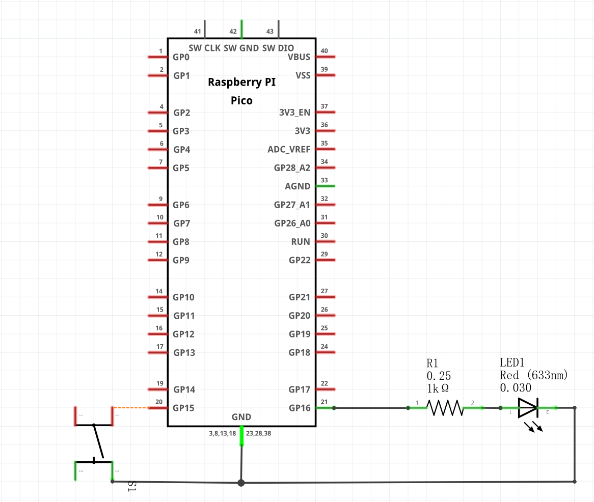

# GPIO
## 器件清单
器件 | 数量
---|---
焊接排针的Pico | 1
面包板  | 1
直插按键 | 1
直插LED | 1
适当阻值的直插电阻 | 1
双公头杜邦线 | 若干
## 原理图

## 实物连接图

## 实现功能
当按键(GPIO25)按下时,外部LED电平翻转(GPIO16)并点亮板载LED(GPIO25).
当按键(GPIO25)释放后，熄灭板载LED(GPIO25).
## machine.Pin类
* machine.Pin(id, mode=None, pull=None, value)
    * Pin对象构造函数
    * id：GPIO编号，数值为0-29，如使用GPIO13则此处填写13,。；
    * mode：模式,可选None、Pin.IN(0)、Pin.OUT(1)、Pin.OPEN_DRAIN(2)；
    * pull：使用内部上下拉电阻，仅在输入模式下有效，可选 None、Pin.PULL_UP(1)、Pin.PULL_DOWN(2)；
    * value：输出或开漏模式下端口值，0为低(off)、1为高(on)；
* Pin.init(mode=None, pull=None)
    * 重新初始化GPIO口；
    * mode：模式,可选None、Pin.IN(0)、Pin.OUT(1)、Pin.OPEN_DRAIN(2)；
    * pull：使用内部上下拉电阻，仅在输入模式下有效，可选 None、Pin.PULL_UP(1)、Pin.PULL_DOWN(2)；
* Pin.value([x])
    * 不填写参数的情况下返回GPIO端口数值，在填写参数的情况下将参数写入GPIO端口中，参数可为0或者1；
* Pin.toggle()
    * 输出或开漏模式下将端口设置翻转
* Pin.low()
    * 输出或开漏模式下将端口设置为低；
* Pin.off()
    * 输出或开漏模式下将端口设置为低；
* Pin.high()
    * 输出或开漏模式下将端口设置为高；
* Pin.on()
    * 输出或开漏模式下将端口设置为高；
* Pin.irq(handler=None,trigger=(Pin.IRQ_FALLING | Pin.IRQ_RISING))
    * 用于设置外部中断
    * handler：中断触发回调函数；
    * trigger：中断触发条件，设置为：
        * Pin.IRQ_FALLING 下降沿中断。
        * Pin.IRQ_RISING 在上升沿中断